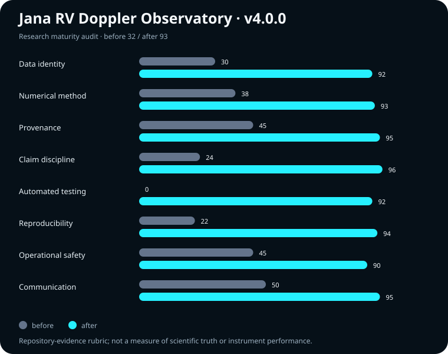

# Jana’s RV Doppler Observatory

A provenance-first radial-velocity workbench with a 250-target archive-quality audit, fail-closed analysis gates, a tested multi-instrument period scan, and a bounded first-pass Keplerian grid.

[](https://github.com/Biswajit1999/Jana-s-RV-Doppler-Observatory/actions/workflows/verify.yml)
[](https://github.com/Biswajit1999/Jana-s-RV-Doppler-Observatory/releases)

**[Open the live observatory →](https://biswajit1999.github.io/Jana-s-RV-Doppler-Observatory/)**



## Result first

Version 4.0.0 asks whether all 250 committed target files are ready for automatic orbital inference under six explicit contracts. The audit covers 154,150 rows and binds every file to a SHA-256 receipt.

| Finding | Result |
|---|---:|
| Files passing every gate | **39 / 250** |
| Files containing repeated epochs | **158** |
| Rows in conflicting same-epoch groups | **34,153** |
| Files merging multiple references behind one instrument label | **181** |
| Files with full/robust RV-span ratio above 20 | **44** |
| Invalid numeric rows | **0** |
| Non-positive uncertainty rows | **0** |

The negative result is operationally useful: parsing validity is excellent, but only 15.6% of the bundle passes every inference-readiness gate. The web app now blocks automated scanning/fitting for bundled files that fail the audit and identifies the failed gates. It does not call the underlying archive measurements invalid.

## Research question and hypothesis

**Question:** Are the 250 committed RV target files inference-ready under declared identity, uncertainty, duplication, offset-separability, and outlier contracts?

**Hypothesis:** Most files will pass numerical parsing, but merged provenance and repeated epochs will prevent automatic orbit-inference readiness without target-specific curation.

The tested numerical core also runs in a dedicated browser worker, keeping the interface responsive without changing the estimator. A complementary structural ledger (`OBSERVATIONAL_INTEGRITY.md` and `data/observational-integrity.json`) checks snapshot metadata, manifest row conservation, archive labels, physical ranges, and file hashes; regenerate it with `npm run audit:observations`.

The committed result supports that hypothesis for this bundle. It is a data-contract study, not a planet census or signal-detection result.

## What changed scientifically

- Added a deterministic audit of every committed target file and row.
- Stopped treating multiple merged literature references labelled only `DACE` as separable instrument zero points.
- Preserved an independent weighted offset for each declared instrument instead of forcing the first instrument’s systemic velocity to zero.
- Centered each instrument before the weighted candidate-period scan, preventing large between-instrument zero points from dominating the scan.
- Replaced the five-point amplitude search with an analytic weighted amplitude solution at each eccentricity/argument/phase grid point.
- Removed unsupported analytic false-alarm-probability lines. The browser result is now labelled a descriptive candidate-period scan; significance requires a declared null model and validated bootstrap/Baluev calculation.
- Rejected non-finite and non-positive declared uncertainties instead of silently replacing them with 1 m/s.
- Added input, redirect, response-size, upload-size, and SELECT-only controls to the optional backend.

The underlying weighted sinusoid follows the generalized Lomb–Scargle least-squares construction described by [Zechmeister & Kürster (2009)](https://www.aanda.org/articles/aa/pdf/2009/11/aa11296-08.pdf). Astropy’s [Lomb–Scargle significance guidance](https://docs.astropy.org/en/stable/api/astropy.timeseries.LombScargle.html) explains why the distribution of the maximum peak is not available as a simple universal analytic expression.

## Six inference-readiness gates

A file passes only if all gates pass:

1. every row has finite time, RV, and positive uncertainty;
2. exact duplicate fraction is at most 1%;
3. repeated-epoch row fraction is at most 1%;
4. multiple literature references are not collapsed behind a single instrument label;
5. full RV range divided by the central 90% range is at most 20;
6. every row has a reference or source field.

The 1% and ratio-20 boundaries are declared triage thresholds, not universal astrophysical constants. The per-file JSON preserves each primitive metric so reviewers can apply other thresholds.

## Reproduce the release

Requires Node.js 24 and Python 3.12.

```bash
python -m pip install -r backend/requirements.txt
python scripts/audit_rv_library.py --check
python -m unittest discover -s tests -p "test_*.py"
npm run check
python -m compileall -q backend scripts
```

To regenerate the evidence products from the committed CSV bundle:

```bash
python scripts/audit_rv_library.py
```

No remote data refresh occurs during test, build, or deployment.

## Evidence products

| Artifact | Purpose |
|---|---|
| `research/rv-library-quality-audit.json` | research question, gates, aggregate findings, 250 per-file records, SHA-256 receipts |
| `research/rv-library-quality-audit.csv` | analysis-ready per-target metrics |
| `assets/research-maturity-before-after.svg` | documented before/after repository audit |
| `docs/METHODS.md` | equations, gate definitions, falsifiers, and limitations |
| `docs/CLAIMS.md` | supported, bounded, and rejected claims |
| `docs/BASELINE_AUDIT.md` | scored maturity comparison and defects corrected |

## Analysis boundary

The in-browser scan is a candidate generator. It does not provide:

- a false-alarm probability, Bayes factor, detection probability, or planet confirmation;
- correlated-noise, stellar-activity, trend, or multi-planet inference;
- posterior uncertainties or model selection;
- automated unit reconciliation across source publications;
- source-level de-duplication for files that fail the audit.

The first-pass Keplerian grid holds period fixed and searches a finite eccentricity/argument/phase grid while solving amplitude and declared instrument offsets analytically. Its output is a diagnostic starting point, not a publication-grade orbit.

## Data provenance

The bundle contains 250 website-ready target files derived from `NASA_RADIAL` and `DACE_PUBLIC`, with the existing manifest reporting a larger upstream merge of 1,922 targets. NASA describes its RV time series as community-contributed data from published literature and exposes the files through its [RV resources](https://exoplanetarchive.ipac.caltech.edu/docs/rv.html). DACE’s public spectroscopy interface reports RV in m/s; see the [public data access tutorial](https://dace.unige.ch/pythonAPI/tutorials/spectroscopy/PublicDataAccessSpectroscopy.html).

Source data remain subject to their archive and publication terms. The MIT license in this repository applies to original code and documentation, not third-party observational data.

## Architecture

```text
rv_science.js                       tested numerical core
app.js                              static observatory interface
app_research_evidence.js            reviewer-facing audit panel
scripts/audit_rv_library.py         deterministic 250-file audit
sample_data/rv_library/data/        committed RV bundle
backend/main.py                     optional FastAPI proxy/importer
tests/                              science, audit, and backend contracts
research/                           machine-readable evidence
```

The static site works on GitHub Pages. The optional FastAPI backend supports target metadata and bounded imports from an astronomy-host allowlist. See [DEPLOYMENT_BACKEND.md](DEPLOYMENT_BACKEND.md).

## Citation and license

Use [CITATION.cff](CITATION.cff) or cite the archived v4.0.0 release. Original code and documentation are MIT licensed.
